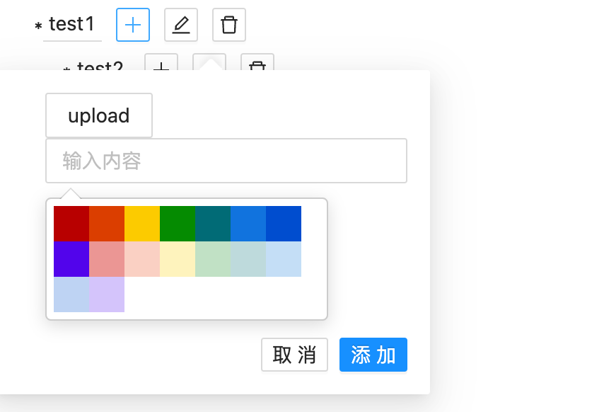

# fast-mindmap

快速生成一个基础的**Mindmap** 项目

## 使用前提

1. 安装[Node.js>=16](https://nodejs.org/en/)

## 使用步骤

1. 克隆项目: `git clone git@github.com:zongUMR/fast-mindmap.git`

2. 安装依赖: `cd fast-mindmap && npm install`

3. 运行项目: `npm start`

## 项目功能

### 内容编辑

1. 创建根节点: 可在输入框内直接创建一个新的根节点，作为**Mindmap**的新初始节点
   
2. 新增子节点: 点击**+**图标， 在当前节点下创建新的子节点，同时自动渲染作为**Mindmap**中的子节点
    - 添加图片: 添加图片作为节点内容
    - 输入内容: 添加文字作为节点内容
    - 颜色选择: 选择节点的线条颜色
      
