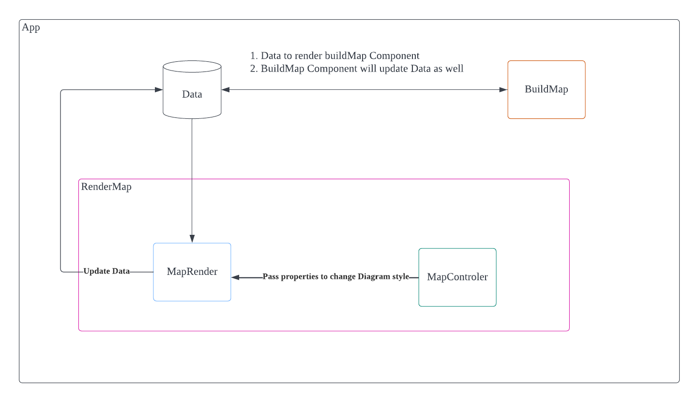
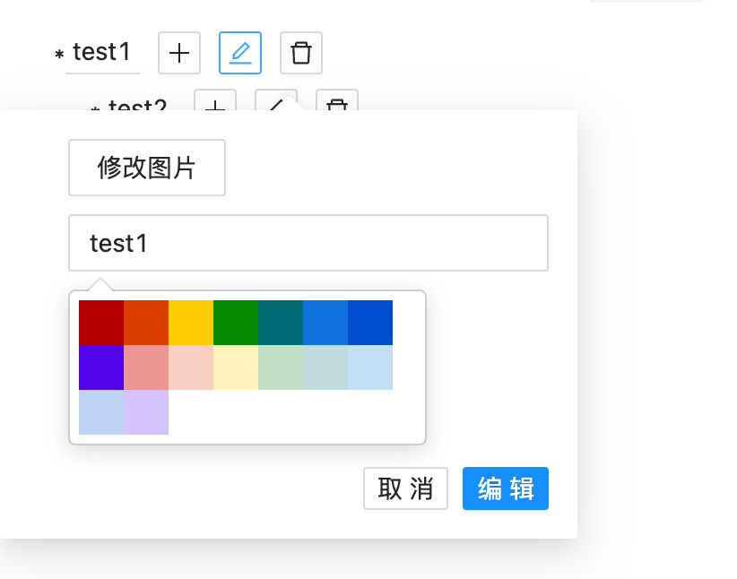
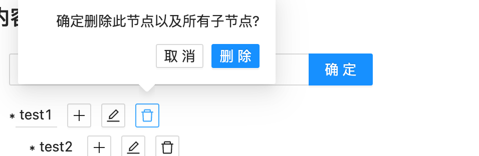
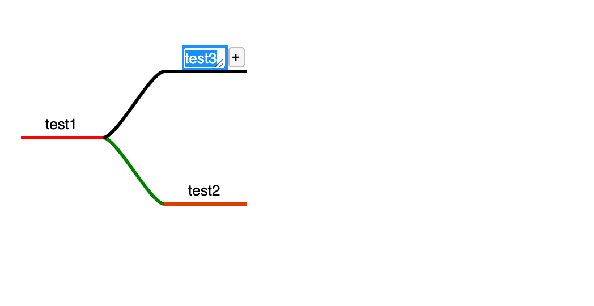
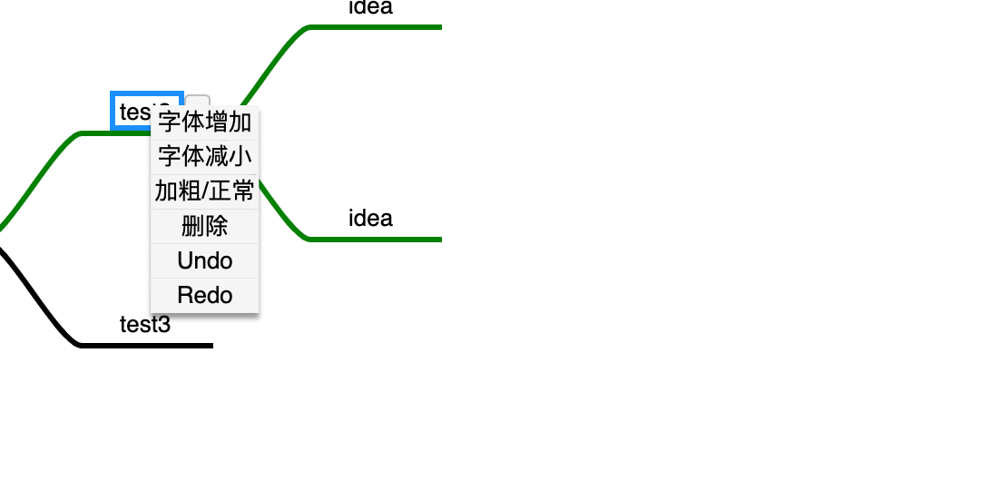
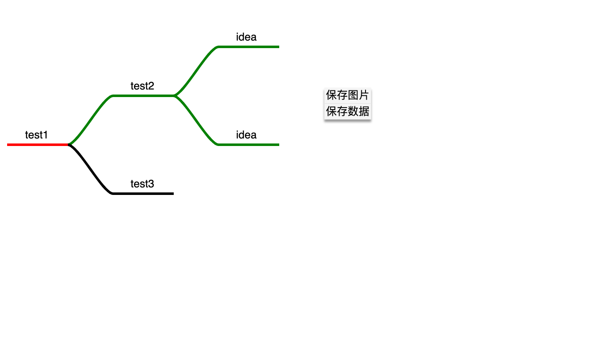

# fast-mindmap

快速生成一个基础的**Mindmap** 项目

## 使用前提

1. 安装[Node.js>=14](https://nodejs.org/en/)

## 本地使用

1. 克隆项目: `git clone git@github.com:zongUMR/fast-mindmap.git`

2. 安装依赖: `cd fast-mindmap && npm install`

3. 运行项目: `npm start`, 打开网址 _http://localhost:3000_

## 线上预览

使用[Vercel](https://vercel.com)自动检测代码， 只要 Repo 中有代码推送，即自动部署。
[预览地址](https://fast-mindmap.vercel.app/)

## 项目用到的技术

1. [Vite](https://vitejs.dev/) + [TypeScript](https://www.typescriptlang.org/) + [React](https://reactjs.org/) 作为项目基础框架
2. [GoJS](https://gojs.net/) + [gojs-react](https://github.com/NorthwoodsSoftware/gojs-react) 作为基础的图表渲染引擎
3. [Ant.design](https://ant.design/) + [React-color](https://casesandberg.github.io/react-color/#usage-include) 分别作为 _UI libraray_ 和 _颜色选择_ 组件
4. [Jest](https://jestjs.io/) + [Testing libraray](https://testing-library.com/docs/react-testing-library/intro/) 作为单元测试框架
5. [eslint](https://eslint.org/) + [Husky](https://typicode.github.io/husky/#/) 作为代码 lint 自动化工具

## 项目功能

### 项目架构

### 内容编辑

1. 创建根节点: 可在输入框内直接创建一个新的根节点，作为**Mindmap**的新初始节点
   
2. 新增子节点: 点击 **+** 图标， 在当前节点下创建新的子节点，同时自动渲染作为**Mindmap**中的子节点
   - 添加图片: 添加图片作为节点内容(_png/jpeg_)
   - 输入内容: 添加文字作为节点内容
   - 颜色选择: 选择节点的线条颜色
     
3. 编辑子节点: 点击 **笔记** 图表，对当前节点进行修改，同时自动渲染**Mindmap**对应的节点
   - 修改图片: 使用新的图片作为节点素材
   - 输入内容: 修改节点文字
   - 颜色选择: 修改节点的线条颜色
     
4. 删除节点: 删除当前节点以及对应的所有子节点
   

### 内容渲染

#### 布局控制

1. 角度: 调整**Mindmap**的渲染角度布局
2. 对齐方式: 调整**Mindmap**节点的渲染对齐方式
3. 排序方式: 调整**Mindmap**节点的排序方式

#### **Mindmap** 渲染结果

使用[GoJS](https://gojs.net/latest/index.html) 和[gojs-react](https://github.com/NorthwoodsSoftware/gojs-react) 作为基础的渲染技术

1. 可对渲染图中的节点进行**双击**, 进行文字内容的修改
   
2. **单击**图中节点，会在右侧出现**节点添加**标记，点击之后会自动添加一个子节点
3. 在**节点上进行右键点击**, 会出现节点功能列表:
   - 字体增加/减小: 修改字体大小
   - 加粗/正常: 修改字体的粗体程度
   - 删除: 删除当前节点以及所有子节点
   - Undo/Redo: 撤销/恢复操作
     
4. 在**非节点**区域右键点击，会出现功能列表:

   - 保存图片: 将当前的渲染结果保存为图片
   - 保存数据: 将用户在**渲染结果**中进行的操作保存(_文字修改，子节点增加，节点删除_)，同步到**内容编辑**中
     

5. 如果一个节点带有图片，点击图片会在一个新的标签页打开此图片
